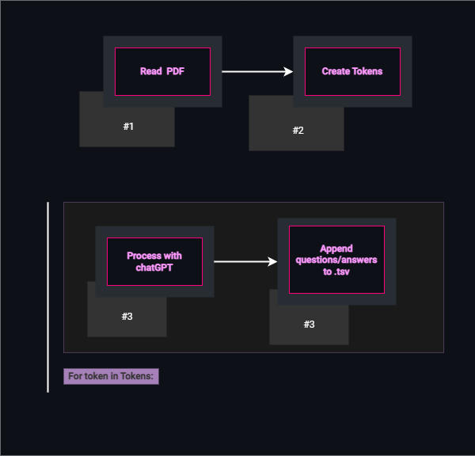

# PDF to Anki Cards

PDF to Anki Cards is a project that automates the process of converting PDF documents into Anki flashcards. The workflow involves several steps:

- **PDF Parsing**: The PDF is read and parsed to extract text content.
- **Text Segmentation**: The extracted text is separated into smaller, manageable chunks suitable for flashcards.
- **Prompt Creation**: Prompts or questions are generated based on the segmented text to facilitate active recall during study sessions.
- **AI Integration**: An AI model is employed to assist in generating effective prompts and improving the quality of flashcards. this is the only manual step, as the solution is completly free. Each prompt must be fed into an AI model like chatGPT.
- **TSV File Generation**: The AI uses the prompts to generate questions and answers, which formatted into a tab-separated values (TSV) file compatible with Anki software.

By automating these steps, "PDF to Anki Cards" offers a streamlined solution for learners to convert PDF content into Anki flashcards, enhancing their study efficiency and retention.

